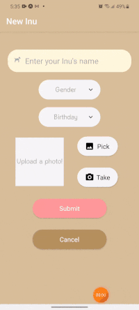
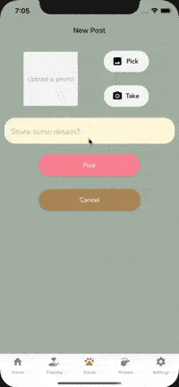
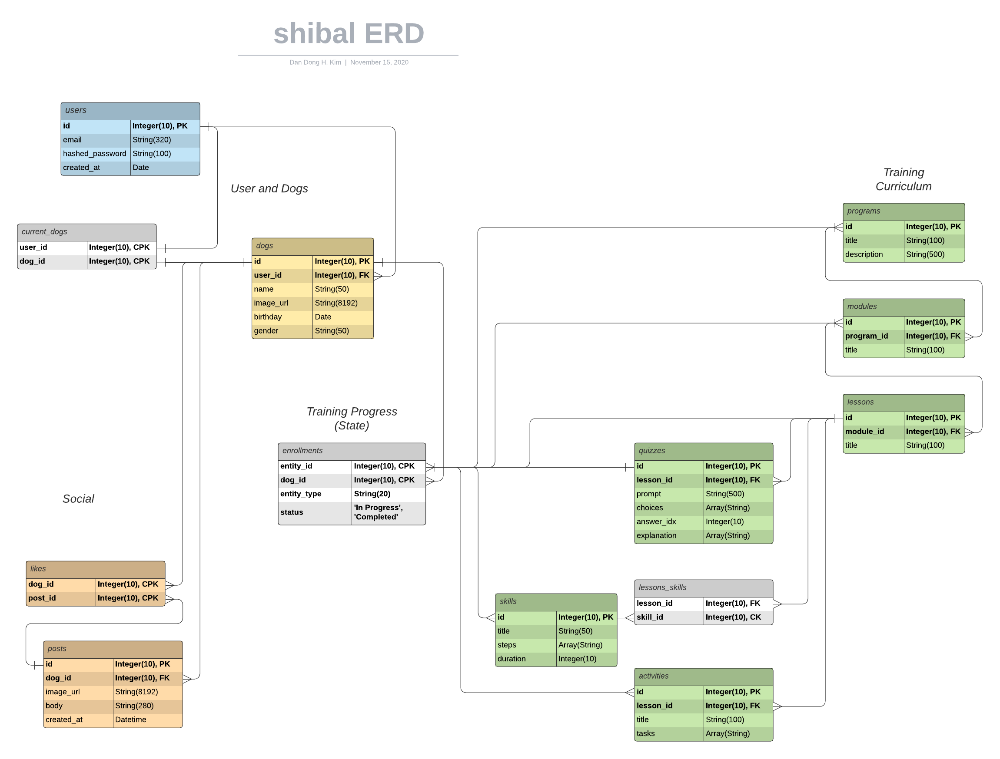

<!--    <a href="https://wogos.herokuapp.com/"> -->
      
<!--    </a> -->

---
### A mobile app for shiba inu owners to train and bond with their companion

---
*By Dong Hyuk Kim*  
Welcome to Shibal! Shibal is an Android/iOS cross-platform mobile app built with React Native and Flask maintained in a single code base. Shibal offers a one-stop tool for training your shiba inu through detailed modules and socializing with other owners via a social media platform. It is inspired by [DOGO](https://dogo.app/), a popular dog training app.

      

---

#### Technologies at a glance:

- Frontend - JavaScript | React Native | Redux
- Backend - Python | Flask
- Database - PostgreSQL / AWS S3
- Design - JSX

---

## Features 
    
### Authentication 
Sign up or log in with email and password  
###### Secure with JWT token and SHA-256 hashing 
###### Data integrity with frontend and backend validations 
###### Bootstrap user across app navigation with useAuth custom hook         

    
### Dog Profiles 
Create one or more profiles for your dog(s) 
Select dog to train  
###### Upload profile image to AWS S3 
###### Enter info with custom input and picker components          

     
### Training Programs 
Navigate between training programs and submodules 
Keep track of your dog's progress  
###### Manage deeply-nested training progress state with Redux 
###### Process state with recursive logic via useProgress custom hook         

   
### Social 
Post photos of your dog to the feed 
Browse recent posts 
Like posts from the community  
###### Fetch posts realtime with useFocusEffect native hook 
###### Handle like and unlike with composite primary key           

---
### Entity Relationship Diagram

